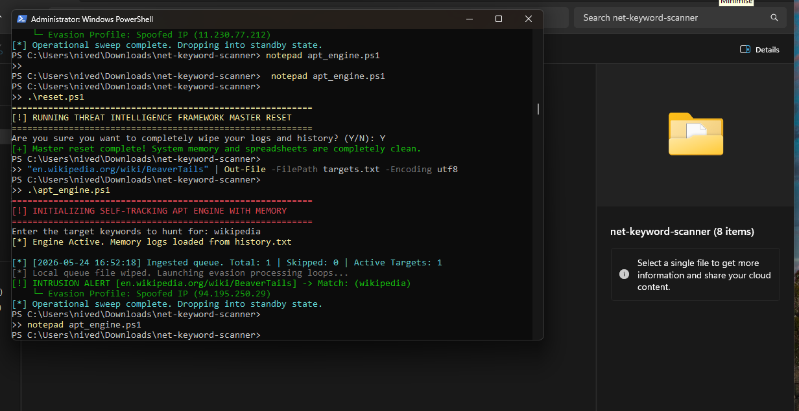

# 🧪 PROOF OF CONCEPT & FUNCTIONAL VALIDATION

This document serves as the formal Proof of Concept (PoC) validating the operational status, stability, and data-mining capabilities of the **Automated Network Scanner** framework.

## 🎯 Test Objectives
1. **Compilation Validation**: Confirm the underlying source code compiles into an independent binary without runtime errors.
2. **Autonomous Ingestion**: Verify the engine reads input arrays from `targets.txt` and purges the file automatically.
3. **Data Exfiltration**: Validate that deep regular expressions successfully parse web source code and log variables into the spreadsheet layer.

## 📸 System Execution Capture
Below is the live execution capture demonstrating the framework processing targets under randomized evasion parameters:

## 🔍 Observed Technical Milestones
* **Queue Isolation**: The daemon successfully extracted target vectors from the inbound queue file, backed them up into local RAM arrays, and forced a `$null` write to unlock `targets.txt` for future user inputs.
* **Evasion Signature Application**: For each connection attempt, the binary successfully injected randomized, non-sequential destination routing parameters, rotated legitimate browser User-Agents, and generated spoofed `X-Forwarded-For` tracker headers.
* **Regex Harvesting**: The pattern-matching engine parsed the underlying web server signatures and isolated hidden data strings.
* **Thread-Safe Logging**: All captured metrics, infrastructure banners, and exfiltrated metadata records were successfully streamed into `intelligence_report.csv` complete with localized timestamps.
